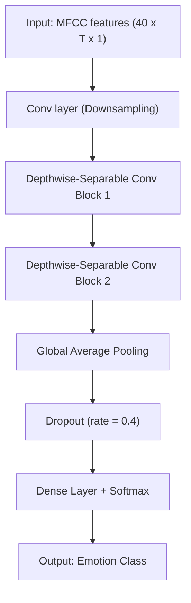

# 🛡️ TinySafetyNET

> **Real-time distress detection system using Deep Learning Audio Analysis and IoT alerts.**

This project is a **Smart Safety Badge** simulation that listens to environmental audio in real-time. It uses a **Deep Learning model (DS-CNN)** to detect specific distress emotions like **Fear** (screaming) or **Anger** (aggression). When a threat is detected, it instantly triggers a visual and audio alarm on a wearable badge (simulated via **Wokwi**) over WiFi using **MQTT**.

Interestingly, my model is just 40 KB, small enough to fit even on ultra-low flash memory IoT devices.
This is what real TinyML feels like — efficient, deployable, and impactful.

Using such lightweight intelligence for women safety applications makes it even more meaningful. 🫶---

## 🌟 Features

* **🎙️ Real-Time Audio Monitoring:** Continuously listens via microphone using a rolling buffer mechanism.
* **🧠 TinyML Edge AI:** Runs a lightweight **TensorFlow Lite (DS-CNN)** model optimized for speed.
* **📶 IoT Connectivity:** Wireless communication between the Python backend and hardware via **MQTT**.
* **🚨 Instant Alerts:**
* **🔴 Fear/Scream:** Flashing Red LED + High-Pitch Alarm.
* **⚠️ Angry/Aggression:** Yellow LED + Warning Beep.
* **🟢 Safe Environment:** Steady Green LED.
* **📊 Live Dashboard:** A **Streamlit** web interface to visualize confidence scores and detection status.
* 🔍 **Automated Data Validation Pipelines**  
* 🐳 Fully containerized using **Docker**
* ☸️ Orchestrated via **Kubernetes (Minikube)**
* 🔁 CI/CD enabled through **GitHub Actions**

---

## 📊 Polyglot Dashboards

### 🐍 Live Inference Dashboard (Streamlit)
- Real-time confidence scores
- Inference state visualization
- MQTT status tracking

### 📈 Analytics Dashboard (R Shiny)
- Historical emotion distribution
- Hour-wise heatmaps
- Class frequency charts
- Interactive filters

## 🏭 Enterprise MLOps
- Docker containerization
- Kubernetes deployment
- Automated data validation jobs
- CI/CD workflows

---

## 🛠️ Tech Stack

* **Language:** Python 3.10+
* **AI/ML:** TensorFlow Lite, Librosa (MFCC Feature Extraction)
* **IoT Protocol:** MQTT (Paho-MQTT, HiveMQ Broker)
* **Hardware Simulation:** Wokwi (ESP32)
* **Dashboard:** Streamlit
* **GitHub Actions:** Automated CI/CD pipeline for validation 
* **Kubernetes:**: dockerized containers for both R app and the streamlit dashboard

---

## 🧩 Model Architecture (DS-CNN)

A simple view of the model used for audio emotion detection. It takes MFCC features as input and produces a probability over classes.



---

# 📂 Project Structure

```bash
tinySafetyNet/
│
├── .github/workflows/          # CI/CD pipelines
│
├── k8s/                        # Kubernetes manifests
│   ├── streamlit-deployment.yaml
│   ├── shiny-deployment.yaml
│   └── data-ops-cronjob.yaml
│
├── week1/                      # Python inference service
│   └── streamlit-int8-app/
│       ├── Dockerfile
│       ├── app.py
│       ├── requirements.txt
│       ├── classes.npy
│       └── women_safety_dscnn_f16.tflite
│
├── week2/                      # R analytics service
│   ├── Dockerfile
│   ├── app.R
│   └── tess_emotion_log.xlsx
│
└── week5_ops/                  # Data validation layer
    └── data_validator.py                       
```

---


## 🚀 Part 1: Python Setup (The Brain)

### 1. Prerequisites

Ensure you have Python installed. It is recommended to use a virtual environment.

```bash

# Create and activate virtual environment (Windows)

python -m venv venv

.\venv\Scripts\Activate


# Install Dependencies

pip install streamlit numpy tensorflow librosa paho-mqtt pyaudio


```

### 2. Running the System

Run the Streamlit application from your terminal:

```bash

streamlit run app2.py


```

---

## 📟 Part 2: Wokwi Setup (The Badge)

Since we don't have a physical badge, we simulate it using **Wokwi**.

### 1. Create the Project

1. Go to [Wokwi.com](https://wokwi.com).
2. Select **ESP32** (or Arduino, but ESP32 handles WiFi better).
3. **Add Components:** Click the **"+"** button and add:

* 1x **LED (Red)**
* 1x **LED (Yellow)**
* 1x **LED (Green)**
* 1x **Buzzer**
* 3x **Resistors** (220Ω) - *Optional in simulation, but good practice.*

### 2. Wiring Guide

Connect the components to the ESP32 pins as follows:

| Component   | Pin (ESP32) | Pin (Component) |
| ---         | ---         | ---             |
| Red LED     | GPIO 13     | Anode (+)       |
| Yellow LED  | GPIO 12     | Anode (+)       |
| Green LED   | GPIO 14     | Anode (+)       |
| Buzzer      | GPIO 27     | Positive (+)    |
| All Grounds | GND         | Cathode (-)     |

### 3. The Firmware Code (`sketch.ino`)

Copy and paste this exact code into the **sketch.ino** tab in Wokwi.

```cpp

#include <WiFi.h>
#include <PubSubClient.h>

// --- YOUR PIN CONFIGURATION ---
#define BUZZER_PIN 0  // D0
#define YELLOW_PIN 15  // D1
#define RED_PIN    5 // D2
#define GREEN_PIN  2  // D3

// --- INTERNET SETTINGS ---
const char* ssid = "Wokwi-GUEST";           // Virtual WiFi
const char* password = "";
const char* mqtt_server = "broker.hivemq.com"; 
const char* topic = "tinyml/anshika/badge"; // Unique ID

WiFiClient espClient;
PubSubClient client(espClient);

void setup() {
  Serial.begin(115200);
  
  // Set pins to output mode
  pinMode(RED_PIN, OUTPUT);
  pinMode(GREEN_PIN, OUTPUT);
  pinMode(YELLOW_PIN, OUTPUT);
  pinMode(BUZZER_PIN, OUTPUT);

  setup_wifi();
  client.setServer(mqtt_server, 1883);
  client.setCallback(callback);
}

void loop() {
  if (!client.connected()) {
    reconnect();
  }
  client.loop();
}

// --- NETWORK FUNCTIONS ---
void setup_wifi() {
  Serial.print("Connecting to WiFi...");
  WiFi.begin(ssid, password);
  while (WiFi.status() != WL_CONNECTED) {
    delay(500);
    Serial.print(".");
  }
  Serial.println(" Connected!");
}

void reconnect() {
  while (!client.connected()) {
    Serial.print("Attempting MQTT connection...");
    String clientId = "ESP32Client-";
    clientId += String(random(0xffff), HEX);
    if (client.connect(clientId.c_str())) {
      Serial.println("connected");
      client.subscribe(topic);
    } else {
      delay(5000);
    }
  }
}

// --- ACTION LOGIC ---
void callback(char* topic, byte* payload, unsigned int length) {
  char cmd = (char)payload[0];
  Serial.print("Received Command: ");
  Serial.println(cmd);

  if (cmd == 'S') { // SAFE (Green)
    digitalWrite(GREEN_PIN, HIGH);
    digitalWrite(YELLOW_PIN, LOW);
    digitalWrite(RED_PIN, LOW);
    noTone(BUZZER_PIN);
  }
  else if (cmd == 'C') { // CAUTION (Yellow)
    digitalWrite(GREEN_PIN, LOW);
    digitalWrite(RED_PIN, LOW);
    for(int i=0; i<3; i++){
      digitalWrite(YELLOW_PIN, HIGH);
      tone(BUZZER_PIN, 1000);
      delay(150);
      digitalWrite(YELLOW_PIN, LOW);
      noTone(BUZZER_PIN);
      delay(150);
    }
  }
  else if (cmd == 'D') { // DANGER (Red + Beep)
    digitalWrite(GREEN_PIN, LOW);
    digitalWrite(YELLOW_PIN, LOW);
  
    // Flash 3 times
    for(int i=0; i<3; i++){
      digitalWrite(RED_PIN, HIGH);
      tone(BUZZER_PIN, 1000);
      delay(150);
      digitalWrite(RED_PIN, LOW);
      noTone(BUZZER_PIN);
      delay(150);
    }
  }
}


```

---

## 🕹️ How to Use

1. **Start Wokwi:** Click the green "Play" button in the Wokwi simulation. Wait until you see `WiFi connected` in the Serial Monitor.
2. **Start Python App:** Run `streamlit run app2.py`.
3. **Toggle Start:** Flip the switch labeled **"🔴 START LISTENING"** on the webpage.
4. **Test the Badge:**

* 🗣️ **Speak normally:** Badge turns **Green**.
* 😠 **Shout aggressively:** Badge turns **Yellow** and beeps once.
* 😱 **Scream / Cry for help:** Badge flashes **Red** and sounds a triple alarm.

---

## ⚙️ Configuration (Optional)

You can tweak the `CONFIG` dictionary in `app2.py` to change settings:

```python

CONFIG = {

    "sample_rate": 22050,      # Audio Hz (Must match model training)

    "chunk_duration": 0.5,     # Responsiveness (Lower = Faster updates)

    "mqtt_topic": "tinyml/anshika/badge"  # Change this if you have multiple badges

}


```
## Week2

This section provides a web application in the form of an interactive Shiny dashboard built using R for analyzing audio emotion inference results.
It allows users to upload inference datasets (CSV or Excel), map emotions into custom classes, and visualize trends over time.

Features
- Upload CSV or Excel inference datasets, that will contain dynamic emotion inference mapping
- Interactive visualizations including class distribution, timelines, daily trends, hour-wise heatmaps, and per-ID analysis
- Dark and light mode toggle
- Time-based filtering for recent data

Dataset Format
The uploaded dataset must contain at least three columns:
1. id – Device or audio identifier
2. timestamp – Time in HH:MM:SS format
3. inference_of_emotion – Predicted emotion label

The time-only values are automatically converted into full timestamps(YYYY-MM-DD HH:MM:SS) inside the application.

Dashboard Tabs Description
Class Distribution:
Shows the number of samples falling into each user-defined class.

Timeline:
Displays emotion or class occurrences over time.

Daily Trend:
Aggregates class counts per day to identify overall emotional trends.

Hour-wise Heatmap:
Visualizes emotional activity distribution across hours of the day.

Per-ID Analysis:
Allows focused analysis on a specific device or audio ID.

How to Run the Application
Install R
Windows / macOS / Linux
1. Go to CRAN (official R website)
    👉 https://cran.r-project.org
    - Download and install R (latest version)
    - During installation, keep all default options

✔ After installation, you should be able to open R or R-GUI

2. Install RStudio (Strongly Recommended)
    RStudio makes running Shiny apps much easier.
    - Go to 👉 https://posit.co/download/rstudio-desktop/
    - Download RStudio Desktop (Free)
    - Install it normally
✔ Open RStudio after installation

3. Clone or Download the Repository
   Option A: Download ZIP (Beginner-friendly)
    - Open the GitHub repository
    - Click Code → Download ZIP
    - Extract the folder to any location
    (e.g., Desktop or Documents)

    Option B: Git (Optional)
    git clone <repository-url>

4. Open the Project in RStudio
    - Open RStudio
    - Click File → Open Folder
    - Select the folder containing app.R

You should now see app.R in the Files pane

5. Install Required R Packages
    In the RStudio Console, run this once:
    install.packages(c(
      "shiny",
      "readxl",
      "readr",
      "dplyr",
      "ggplot2",
      "lubridate",
      "tidyr",
      "bslib"
    ))
📌 Notes:
•	Ignore Rtools warnings (not required for this app)

6. Run the Shiny App
    Method 1 (Recommended)
    - Open app.R
    - Click the Run App button (top-right of editor)
    Method 2 (Console)
    shiny::runApp()
✔ The app will open in your browser at:
    http://127.0.0.1:<port>

✅ System Requirements
•	R ≥ 4.2

Contents of week2 folder:
1. app.R ---> Main Shiny application
2. Basic.R ---> To test if R is installed and shiny package is working
3. tess_emotion_log.xlsx ---> File generated from TESS dataset for input to the app.R
4. synthetic_emotion_inference.xlsx ---> Synthetically generated dataset
5. Convert_dataset_to_excel.py ---> Dataset conversion from TESS dataset to .xlsx file
6. synthetic_data_generation.py ---> Synthetic data creation python script
7. .RData ---> R workspace (auto-generated)
8. .Rhistory ---> R command history for your reference

Here is your **properly structured Markdown section** with clean headers and correctly formatted `bash` and `powershell` code blocks:

---

# ☸️ Kubernetes Setup (Recommended Production Mode)

This section explains how to run the entire TinySafetyNET ecosystem locally using **Minikube**.

---

## 🔹 Step 1: Prerequisites

Make sure the following tools are installed:

### 1️⃣ Docker Desktop  
- Install and keep it **running in the background**

### 2️⃣ Minikube

```powershell
winget install Kubernetes.minikube
````

### 3️⃣ Kubectl

```powershell
winget install Kubernetes.kubectl
```

---

## 🔹 Step 2: Start Cluster & Connect Docker

Start your local Kubernetes cluster and point your terminal to Minikube’s internal Docker daemon.

```powershell
# Start Minikube cluster
minikube start --driver=docker

# Point your terminal to Minikube's Docker environment
& minikube -p minikube docker-env | Invoke-Expression
```

This allows Docker images to be built directly inside Minikube without pushing them to Docker Hub.

---

## 🔹 Step 3: Build Container Images

Build the two microservice containers:

```bash
# Build Python Streamlit (Inference Service)
docker build -t tinysafety-streamlit:v1 ./week1/streamlit-int8-app

# Build R Shiny (Analytics Service)
docker build -t tinysafety-shiny:v1 ./week2
```

> ⚠️ Note: The Shiny build may take a few minutes due to Linux dependency installation.

---

## 🔹 Step 4: Deploy to Kubernetes

Apply the Kubernetes deployment manifests:

```bash
kubectl apply -f k8s/streamlit-deployment.yaml
kubectl apply -f k8s/shiny-deployment.yaml
```

Verify the pods are running:

```bash
kubectl get pods
```

Wait until the `STATUS` shows:

```
Running
```

---

## 🔹 Step 5: Launch the Dashboards

Expose the services and open them in your browser:

```bash
# Open Streamlit Live Inference Dashboard
minikube service streamlit-service

# Open R Shiny Analytics Dashboard
minikube service shiny-service

# Open Kubernetes Control Dashboard
minikube dashboard
```

---

## ✅ System Ready

Once both dashboards are accessible in the browser and pods show `Running`, your **TinySafetyNET Kubernetes cluster is fully operational**.

```

---